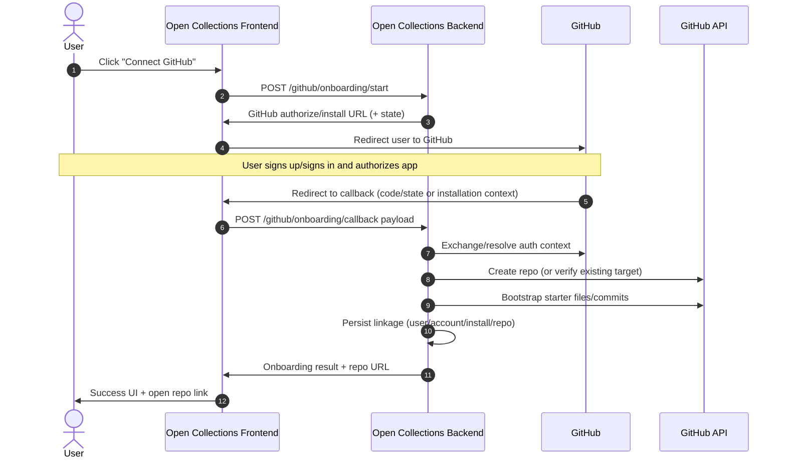

# GitHub onboarding flow

Date: 2026-03-31
Status: Draft implementation plan
Owner: Platform + Integrations

## Summary

This document defines the preferred GitHub onboarding flow for Open Collections clients using a **GitHub App authorization flow** instead of manual Personal Access Token (PAT) onboarding.

The primary outcome is: a user can click **Connect GitHub**, authenticate/authorize via GitHub, return to Open Collections, and have a public repository created + bootstrapped without copy/pasting credentials.

This is an implementation-oriented plan for backend/frontend work, operational safeguards, and rollout.

For broader onboarding/discovery/classification and hosting-connection strategy, see `docs/architecture/onboarding-and-connection-flow.md`.

## Goals

- Remove manual PAT copy/paste from default onboarding.
- Use GitHub App authorization as the standard integration path.
- Create/link a client-owned public repository from backend services.
- Bootstrap required collection/config/starter files in that repository.
- Provide clear success/failure UX and deterministic retry behavior.
- Persist account/install/repo linkage so onboarding is resumable.

## Non-goals

- Supporting all possible GitHub organization policy variants in v1 (we will document fallbacks).
- Building full bidirectional sync in onboarding.
- Designing a generalized identity provider system in this phase.
- Deprecating PAT immediately for all legacy users (PAT can remain as explicitly advanced/fallback for now).

## Why GitHub App over PAT

GitHub App onboarding is preferred because it:

- reduces credential handling risk (scoped, revocable app authorization vs long-lived broad PAT handling)
- improves UX (no manual token generation/copy/paste)
- supports clearer permission boundaries and auditable installation events
- aligns with least-privilege and rotating short-lived tokens for server-to-GitHub API operations

Explicit product/security position:

- We should **avoid PAT-based onboarding as the default**.
- **GitHub App authorization is the preferred approach**.
- PAT onboarding (if still needed) should be marked as compatibility/advanced fallback.

Also explicit platform constraint:

- We **cannot create normal GitHub user accounts via API**.
- Users must **sign up/sign in with GitHub themselves** before they can authorize our app.

## User journey

1. User clicks **Connect GitHub** in Open Collections.
2. If user has no GitHub account, app sends user to GitHub sign-up first.
3. User signs in and authorizes/install our GitHub App.
4. GitHub redirects user back to Open Collections callback URL.
5. Backend validates callback context and completes authorization exchange.
6. Backend creates (or selects) a public repository for the client.
7. Backend bootstraps repository with required collection/config/starter files.
8. App shows success state with repository link and next-step actions.

## System flow

## Detailed implementation plan

### Phase 0: Foundation and decisions

- Decide app ownership model (single app across environments vs per-environment app).
- Finalize redirect URIs, callback route, and environment secrets strategy.
- Define repository naming convention + collision policy.
- Define bootstrap contract (required files, default branch/path, idempotency markers).

### Phase 1: GitHub App setup

- Create GitHub App and set:
  - app name, homepage URL, callback/redirect URL(s)
  - permission scopes required for repo create/content writes
  - optional webhook subscriptions for install/revoke events
- Add environment variables/secrets for:
  - app id
  - private key
  - client id/client secret (if used in chosen auth path)
  - webhook secret

### Phase 2: Backend onboarding service

- Implement `POST /github/onboarding/start`:
  - validate signed-in Open Collections user/session
  - create signed `state` (csrf + correlation + expiry)
  - return authorization/install URL
- Implement callback handler (`GET` or `POST` depending on deployment model):
  - verify `state`
  - exchange `code` / resolve installation context
  - fetch GitHub user identity + installation details
  - persist linkage (internal user -> github account -> installation)
- Implement orchestration step for repo provisioning and bootstrap.

### Phase 3: Repo provision + bootstrap

- Add repo creation service with idempotency keying:
  - detect if target repo already exists/linked
  - create public repo if missing
  - set default branch behavior
- Add bootstrap service:
  - write required directory layout/files
  - create initial commit(s)
  - mark bootstrap version in repo metadata file
- Ensure retries are safe (idempotent writes or conflict-safe updates).

### Phase 4: Frontend UX integration

- Add **Connect GitHub** CTA in account/onboarding surface.
- Handle redirect lifecycle:
  - start flow -> leave app -> callback return
  - loading/pending state and retry action
- Display deterministic outcomes:
  - success with repo URL
  - actionable failure with support/error code
- Add resume behavior when onboarding is partially complete.

### Phase 5: Observability + rollout

- Structured logs keyed by onboarding correlation id.
- Metrics: start/success/failure counts and failure reason categories.
- Add feature flag for staged rollout.
- Run internal test cohort before broad release.

## Backend requirements

- Stateful onboarding session model (short-lived) with anti-CSRF `state` validation.
- Durable linkage model:
  - internal user id
  - GitHub user id/login
  - GitHub App installation id
  - provisioned repository owner/name/url
  - onboarding status + timestamps
- Services:
  - GitHub auth/install resolver
  - repository provisioning
  - bootstrap writer
- Operational requirements:
  - timeout/retry policy for GitHub API calls
  - idempotency keys for create/bootstrap
  - compensating behavior for partial failures
- Webhook handlers (recommended):
  - installation removed/suspended events
  - optional repo permission drift checks

## Frontend requirements

- Entry point CTA in onboarding/account UI: **Connect GitHub**.
- Callback page/route that can:
  - parse callback params
  - show pending state while backend finalizes onboarding
  - show clear success/failure states
- UX copy must explicitly guide users that:
  - GitHub sign-up/sign-in is completed on GitHub
  - Open Collections cannot create GitHub user accounts for them
- Recovery UX:
  - retry connection
  - reconnect after revocation
  - use fallback support path when org policy blocks install

## Repo bootstrap requirements

Define a versioned bootstrap template contract (example):

- `README.md` with client-specific onboarding context
- base collections folder (for example `/collections/`)
- required config files for Open Collections discovery/publish workflows
- optional sample starter collection
- bootstrap metadata marker (for example `.open-collections/bootstrap.json`) including template version and timestamp

Bootstrap behavior expectations:

- idempotent re-run should not duplicate starter assets
- template upgrades should be explicit and version-aware
- partial bootstrap should be detectable and repairable

## Security and token handling

- Do not request/store PAT for default onboarding flow.
- Use GitHub App auth with least-privilege permissions.
- Store secrets in server-side secret manager only (never in frontend/local storage).
- Validate `state` and enforce short expiration on onboarding sessions.
- Use short-lived tokens for GitHub API actions where applicable.
- Never log tokens, private keys, authorization codes, or raw callback secrets.
- Encrypt sensitive linkage metadata at rest where policy requires.
- Record audit events for onboarding lifecycle transitions.

## Failure cases

Core failure scenarios and expected behavior:

- **User cancels authorization**: return to app with clear retry CTA.
- **Invalid/expired state**: hard-fail callback, require restart.
- **Missing installation permissions**: show remediation guidance and required permission list.
- **Repo name collision**: apply naming strategy or prompt rename; keep onboarding resumable.
- **Bootstrap commit failure after repo create**: mark partial state, offer retry repair path.
- **Rate limiting / transient GitHub API errors**: retry with backoff + user-safe status.
- **Installation revoked after onboarding**: detect via webhook/on-demand check and mark connection degraded.
- **Org policy blocks app install/repo create**: surface policy error and admin handoff guidance.

## Rollout plan

1. Ship docs + internal runbook + test checklist.
2. Implement feature-flagged backend endpoints and frontend CTA/callback.
3. Enable for internal/staging tenants first.
4. Validate metrics (completion rate, failure categories, median setup time).
5. Iterate on top failure reasons.
6. Make GitHub App flow default for new users.
7. Keep PAT as explicit fallback only until deprecation decision.

## Open questions

- Should repo creation always be user-owned, org-owned, or selectable?
- What is the default repo naming convention and collision suffix policy?
- What exact GitHub App permissions are minimally required for v1?
- Do we require webhook-driven revocation handling at launch or phase 2?
- Should bootstrap create a starter collection by default or opt-in?
- Do we need regional data-residency constraints for linkage metadata?
- What is the long-term plan/timeline for PAT fallback deprecation?

## Concise implementation checklist

- [ ] Create/configure GitHub App.
- [ ] Define and document required permissions.
- [ ] Implement **Connect GitHub** CTA in UI.
- [ ] Implement redirect/callback endpoint(s).
- [ ] Store installation/account linkage.
- [ ] Implement repo creation service.
- [ ] Implement repo bootstrap/collections setup.
- [ ] Add logging, retries, and explicit error states.
- [ ] Add docs/tests and operational runbook.
