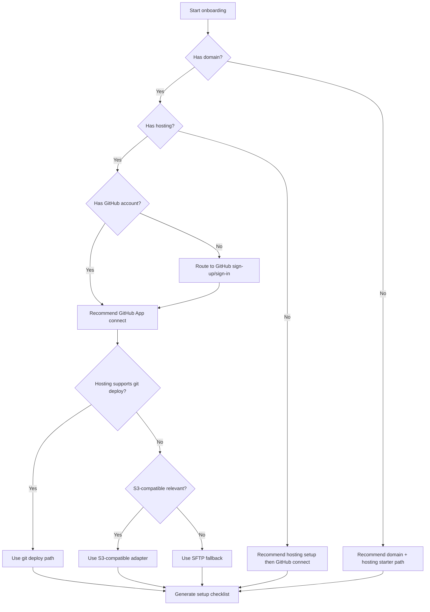
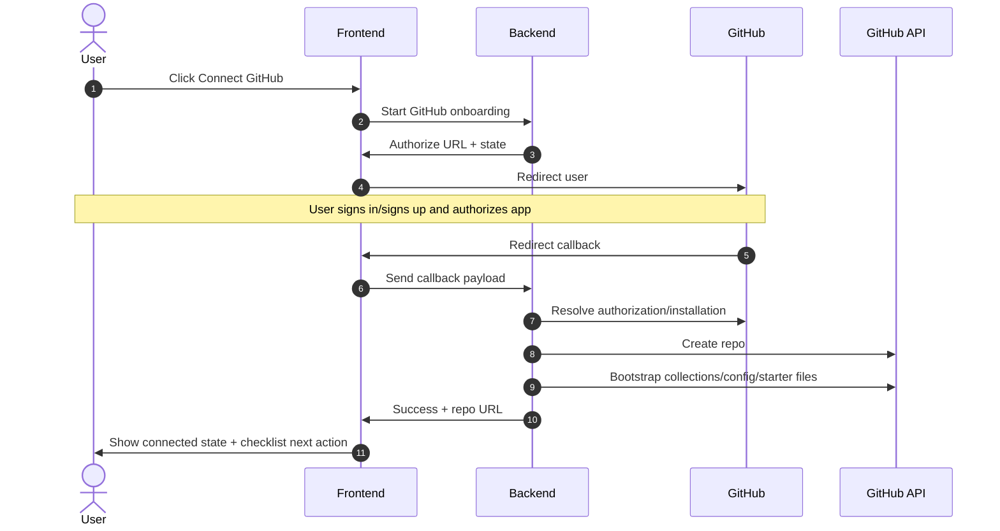

# Onboarding and connection flow

Date: 2026-03-31  
Status: Draft product + engineering plan  
Owner: Product + Platform + Integrations

## Summary

This document defines a practical onboarding strategy for users who want to publish/manage a collection or site, regardless of whether they already have a domain, hosting, a live site, and/or a GitHub account.

The core product behavior is:

- discover what the user already has
- classify their setup state
- recommend the easiest viable path
- guide them through concrete actions step by step

The default source-control integration path is **GitHub App authorization**. PAT-based onboarding remains a fallback path only.

## Goals

- Capture setup context once, in plain language, and persist it.
- Generate a structured setup profile that can drive recommendation logic.
- Recommend the easiest next path instead of requiring users to choose technical transport/protocols.
- Make GitHub App auth the default GitHub connection experience.
- Support users with existing infrastructure as well as users starting from zero.
- Keep onboarding resumable and safe for users with existing live sites.

## Non-goals

- Building a full generalized multi-VCS identity system in MVP.
- Supporting every hosting provider edge case before launch.
- Forcing all users into migration in a single onboarding pass.
- Removing PAT fallback immediately for every legacy environment.

## Product principles

- **Collect once, decide for them, guide clearly**: ask only what is needed, infer technical path internally, and provide action-oriented next steps.
- **Use plain language**: ask "Do you already have hosting?" rather than "Select deployment transport protocol."
- **Progressive disclosure**: ask high-value questions first, then conditional follow-ups.
- **Allow "I don't know" answers**: unknown answers should route to assistive/default-safe paths, not dead ends.
- **Guided actions over technical instructions**: prefer buttons and in-product guided tasks over external how-to text walls.
- **Save progress and support partial onboarding**: users should be able to pause and resume without data loss.

## Discovery model

Discovery starts with four high-value questions:

1. Do you already have a domain?
2. Do you already have hosting?
3. Do you already have a GitHub account?
4. Are you connecting an existing website or creating a new one?

Then ask only relevant follow-ups.

### Follow-up questions (conditional)

- **Domain**
  - domain name
  - registrar
  - whether user has DNS access
- **Hosting**
  - hosting provider
  - hosting type (git-capable platform, object storage/CDN, shared/legacy host, unknown)
- **Current site state**
  - site already live or not
  - overwrite risk / migration needed
- **GitHub/source control**
  - GitHub username/account status
  - whether user wants existing repo/setup or fresh setup
- **Migration readiness**
  - import/migration needed
  - technical comfort and whether they have developer help

Discovery should allow explicit `unknown`/`not sure` values and continue.

## Setup profile

The onboarding system should persist a structured setup profile that is complete enough for deterministic recommendations.

### Proposed profile shape (MVP)

```json
{
  "userId": "...",
  "collectedAt": "2026-03-31T00:00:00Z",
  "accountBusiness": {
    "orgName": "",
    "projectName": "",
    "technicalComfort": "low|medium|high|unknown",
    "hasDeveloperHelp": true
  },
  "domain": {
    "hasDomain": true,
    "domainName": "example.org",
    "registrar": "Namecheap",
    "hasDnsAccess": true
  },
  "hosting": {
    "hasHosting": true,
    "provider": "...",
    "hostingType": "git|s3_compatible|legacy_sftp|unknown",
    "supportsGitDeploy": true,
    "s3CompatibleAvailable": false,
    "sftpAvailable": true
  },
  "github": {
    "hasGithubAccount": true,
    "githubLogin": "...",
    "connectionMethod": "github_app|pat|none",
    "installationStatus": "connected|not_connected|unknown"
  },
  "siteState": {
    "existingWebsite": true,
    "isLive": true,
    "needsMigration": true,
    "safeToOverwrite": false
  },
  "desiredOutcome": {
    "connectExisting": true,
    "startFresh": false,
    "targetGoLiveDate": null
  },
  "onboarding": {
    "phase": "discovery|classification|guided_setup|complete",
    "status": "in_progress|blocked|complete",
    "lastCompletedStep": "..."
  }
}
```

## Classification and recommendation engine

The system should classify user state and map it to a recommended setup path.

### Example setup classes

- `has_domain + has_hosting + has_github`
- `has_domain + has_hosting + no_github`
- `has_domain + no_hosting`
- `no_domain + no_hosting`
- `legacy_hosting`
- `unknown_provider_or_access`

### Recommendation rule

The app should infer the path and recommend the **easiest viable next step**, prioritizing low-risk completion.

- If GitHub account exists -> start GitHub App connect.
- If no GitHub account -> send to GitHub signup/sign-in first, then resume GitHub App flow.
- If hosting supports git deploy -> recommend git-based deploy path.
- If git deploy not available but object storage path is relevant -> recommend S3-compatible adapter.
- If modern options are unavailable -> use SFTP fallback.
- If live-site overwrite risk is detected -> require migration-safe path and confirmation gates.



## Recommended onboarding flow

Three phases:

1. **Discovery**: collect high-value setup facts and unknowns.
2. **Classification**: map profile to setup class and risk state.
3. **Guided setup**: present recommended path and execute first concrete action.

### Suggested MVP flow

1. Ask the 4 high-value questions.
2. Ask follow-ups only where needed.
3. Generate **Current setup summary + recommended path + checklist**.
4. Start the first concrete action (for many users: Connect GitHub).

## GitHub onboarding flow

Preferred flow:

1. User clicks **Connect GitHub**.
2. If no GitHub account, send user to GitHub signup/sign-in.
3. User authorizes Open Collections GitHub App.
4. User is redirected back to Open Collections.
5. Backend validates callback and completes auth.
6. Backend creates a public repo for the client.
7. Backend bootstraps repo with collections/config/starter files.
8. App shows success state with repo link and next steps.

Explicit notes:

- Normal GitHub user accounts cannot be created via GitHub API.
- GitHub App auth is preferred.
- PAT paste-in onboarding is fallback only (advanced/compatibility), not default.



## Why GitHub App over PAT

- Better UX than manual token generation/copy/paste.
- Finer-grained permissions and better least-privilege posture.
- Stronger security model with revocable/scoped app auth.
- Cleaner long-term integration and better operational observability.

## Hosting and storage connection strategy

Default technical strategy:

- **Git deploy** as default for modern supported setups.
- **S3-compatible adapter** for relevant storage/assets workflows.
- **SFTP fallback** for legacy/traditional hosting.

Important UX rule: onboarding should avoid asking users to choose `Git vs S3 vs SFTP` up front. Ask plain-language questions, infer the best connection path, and guide the user.

## UX flow examples

- **Existing domain + hosting + GitHub**
  - classify as ready-to-connect
  - start GitHub App connect -> verify hosting compatibility -> generate deployment checklist
- **Domain + hosting but no GitHub**
  - route to GitHub sign-up/sign-in -> return to GitHub App connect -> continue setup
- **Domain but no hosting**
  - recommend hosting setup path first -> then GitHub connect and publish pipeline setup
- **No domain, no hosting**
  - provide starter path (domain + hosting recommendations) -> stage technical connections later
- **Legacy hosting / unknown setup**
  - collect minimal provider/access info -> default to safe fallback path (often SFTP) -> flag for migration options

## Setup summary screen

Proposed "Your setup plan" output should include:

- what the user already has
- what is missing
- recommended next step (single primary CTA)
- estimated setup path (for example: "~3 steps")
- blockers/risk notices (for example, live site overwrite protection)

## Failure cases and blockers

Common blockers and expected handling:

- User does not know provider -> keep onboarding moving with `unknown`, suggest discovery help.
- No DNS access -> mark as external dependency and defer domain cutover steps.
- No GitHub account -> explicit GitHub sign-up/sign-in step.
- Existing live site should not be overwritten -> enforce migration-safe checklist and confirmations.
- Hosting supports only legacy access -> use SFTP fallback and surface modernization options.
- User pauses onboarding -> persist state and resume from last completed step.

## Security considerations

- Avoid PAT as default onboarding mechanism.
- Minimize credential collection and secret handling.
- Prefer OAuth/GitHub App auth for source control connection.
- Use secure token handling (state validation, short-lived tokens where possible, secret manager storage).
- Avoid storing unnecessary secrets.
- Treat SFTP/storage credentials as sensitive and redact from logs.

## Implementation plan

### Frontend requirements

- Implement 4-question discovery entry with conditional follow-ups.
- Support `I don't know` answers and non-blocking progression.
- Build setup summary screen with recommended path and checklist.
- Add guided CTA components for first concrete action.
- Implement save-and-resume onboarding UX.

### Backend requirements

- Persist setup profile and onboarding progress state.
- Build classification service and recommendation engine.
- Implement GitHub App start/callback orchestration.
- Implement repo create/bootstrap orchestration with idempotency.
- Expose step-level status for resumable flows.

### Adapter/integration requirements

- Git deploy adapter as primary path.
- S3-compatible adapter for storage/assets where relevant.
- SFTP adapter fallback for legacy hosts.
- Capability detection/normalization layer for providers.

### Data model / onboarding profile requirements

- Structured profile (domain/hosting/github/site/outcome/account).
- Unknown-state support for uncertain user responses.
- Versioned schema for forward migration.
- Audit fields: timestamps, actor, step status, correlation id.

### Logging / retries / error handling

- Structured logs by onboarding session/correlation id.
- Retry policy for transient provider/API failures.
- Idempotency keys for repo create/bootstrap and adapter actions.
- User-safe error messages with support/debug codes.

## Implementation checklist

- [ ] Define onboarding questionnaire.
- [ ] Implement setup profile persistence.
- [ ] Implement recommendation engine.
- [ ] Implement GitHub App setup and callback flow.
- [ ] Implement repo creation service.
- [ ] Implement repo bootstrap / collections setup.
- [ ] Define hosting connection adapters.
- [ ] Support Git deploy path.
- [ ] Support S3-compatible storage path where relevant.
- [ ] Support SFTP fallback.
- [ ] Implement setup summary UI.
- [ ] Implement save-and-resume onboarding.
- [ ] Add logging, retries, and error states.
- [ ] Add tests and docs.

## Open questions

- Should repo ownership default to user account, org account, or be selectable?
- What minimum GitHub App permissions are required for MVP?
- Which hosting providers should be first-class in capability detection?
- What confidence threshold should trigger human support escalation for `unknown` setups?
- How should migration tooling/versioning work for existing live sites with legacy stacks?
- Should we include recommended domain/hosting providers in-product, and if yes, under what policy?
