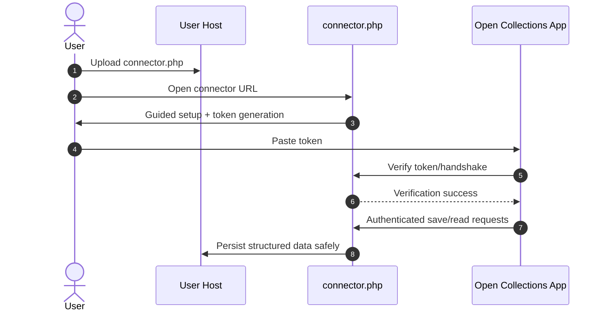

# Self-serve host connector

Date: 2026-03-31  
Status: Draft product + engineering plan  
Owner: Product + Platform + Integrations

## Summary

This document defines the preferred non-Git onboarding path for users who already have hosting and want to connect that host directly to Open Collections.

The intended MVP experience is simple: upload one PHP connector (`connector.php`), open it in a browser, complete setup, copy a generated connection token, and paste that token into Open Collections for verification.

## Goals

- Make setup easy for users to complete themselves.
- Work directly with existing hosting environments.
- Avoid Git as the primary path for this flow.
- Minimize technical setup friction for non-technical and semi-technical users.
- Support a secure, verifiable connection between app and host.

## Non-goals

- Replacing advanced Git-based workflows as the primary path for power users.
- Providing a full abstraction for every hosting provider in the first iteration.
- Requiring SSH, Docker, or manual server management for the default onboarding path.

## Product rationale

This path exists because many users already have hosting and can do a simple file upload, but are blocked by Git-centric setup.

Why this is useful:

- Many users already have a shared hosting account and a live domain.
- Many users are comfortable uploading a file via hosting file manager or SFTP.
- Git setup introduces extra account, permissions, and workflow complexity.
- The product should optimize for the fastest likely success path.

## Proposed user flow

1. User indicates they already have hosting.
2. App recommends direct host connection.
3. User downloads a connector.
4. User uploads `connector.php` to their host.
5. User opens the connector URL in the browser.
6. User completes setup in the connector wizard.
7. Connector generates a connection key/token.
8. User pastes the key/token into Open Collections.
9. Open Collections verifies the connection.
10. Open Collections can now securely read/write required data through the connector.

## Connector shape

- MVP shape: single PHP file (`connector.php`).
- Future shape: small upload package if needed (while keeping same user mental model).
- UX principle remains: users should feel they are "uploading one connector".

Connector responsibilities should include:

- Health/status check.
- First-run setup flow.
- Authenticated read/write actions.
- Safe writes to host storage.
- Clear status and error responses.

## Why PHP

PHP is a practical default for this flow because:

- It is widely available on shared hosting.
- It usually requires no deployment pipeline for small scripts.
- Users can upload via file manager or SFTP.
- It avoids requiring Git, SSH, Docker, or background workers for MVP.

## Security model

Default security posture for this path:

- Connector must be used over HTTPS.
- User creates a strong password during setup, or completes equivalent secure setup flow.
- Connector generates a site-specific API token/key after setup.
- User pastes token into Open Collections; app stores it securely server-side.
- All subsequent connector requests use token-based authentication.
- Do not embed connector secrets in frontend code.
- Do not store passwords in plaintext.
- Store secrets/tokens securely with least-privilege handling.
- If local password auth is used, prefer hashed password storage.
- Add rate limiting and lockout/backoff protections for repeated failed auth.

Important boundary:

- Browser frontend should not directly write to protected storage with embedded credentials.
- Server-side connector code should enforce write authorization and safe persistence.

## Storage model

Recommended storage path:

- MVP: file-based storage on host.
- Store JSON/content/config in non-public directories where possible.
- Add optional MySQL/other storage adapters later only when necessary.
- Handle media/uploads as a later, separate concern if needed.

File-based storage is likely the easiest and most supportable MVP for this self-serve path.

## Example connector responsibilities

Connector actions may include:

- `health` check.
- `status` endpoint/action.
- `setup/init` endpoint/action.
- `save` content/config action.
- `read` current config/status action.

These are conceptual responsibilities for product and engineering alignment; exact endpoint and payload contracts should be defined in a dedicated connector API spec.

## UX principles

The onboarding flow should:

- Use plain language.
- Ask for minimal required information.
- Guide users step-by-step.
- Avoid technical jargon.
- Prefer guided setup over manual instructions.
- Preserve the mental model: "upload one thing, open it, connect it".

## Failure cases and support cases

Common issues to handle explicitly:

- Host does not support PHP.
- User cannot find hosting file manager.
- Site is not on HTTPS.
- Uploaded file is not reachable.
- File/directory permissions block storage writes.
- Legacy hosting restrictions prevent required behavior.
- User needs a fallback path with additional guidance.

## Fallbacks

If direct PHP connector is not viable:

- Use a small upload package (instead of a single file) with same guided setup model.
- Offer SFTP-assisted setup path.
- Offer alternate adapter path for non-PHP hosting.
- Use Git-based setup only as a secondary/advanced fallback for this flow.

## Implementation plan

### Frontend requirements

- Ask "Do you already have hosting?" early in onboarding.
- Recommend direct host connector when hosting exists and user fit is self-serve.
- Provide clear connector download/upload/open instructions.
- Provide token paste + verification UI with actionable error guidance.

### Backend/app requirements

- Persist onboarding answers and connection mode selection.
- Verify connector token/handshake securely.
- Store connector token in secure backend storage.
- Route structured save/read operations through authenticated connector calls.

### Connector requirements

- Ship MVP `connector.php` with setup wizard and token generation.
- Expose health/status/setup/read/write actions.
- Enforce HTTPS + token auth + safe file write constraints.
- Return stable machine-readable status/error responses.

### Onboarding requirements

- Include direct-host recommendation logic in onboarding classifier.
- Keep guidance plain-language and task-oriented.
- Preserve resumable onboarding state.
- Provide contextual fallback guidance when host checks fail.

### Error handling and observability

- Structured error codes for each onboarding and connector stage.
- Correlation/session IDs for support debugging.
- Retry guidance for transient failures.
- Explicit support playbooks for common hosting failure modes.

## Implementation checklist

- [ ] Define onboarding question for "Do you already have hosting?"
- [ ] Define rule for recommending direct host connection.
- [ ] Design connector setup UX.
- [ ] Create MVP PHP connector spec.
- [ ] Define handshake/token exchange flow.
- [ ] Define storage directory/file strategy.
- [ ] Define connection verification flow.
- [ ] Define error states and support guidance.
- [ ] Document fallback behavior.
- [ ] Add tests and docs.

## Open questions

- Should MVP connector be a single PHP file or a small package?
- What exact storage layout should be default?
- Is MySQL support required in MVP or post-MVP?
- How much write capability should connector expose in initial release?
- What is the best path for hosts without HTTPS or PHP?

## Related docs

- [Onboarding and connection flow](./onboarding-and-connection-flow.md)
- [Storage model](./storage-model.md)
